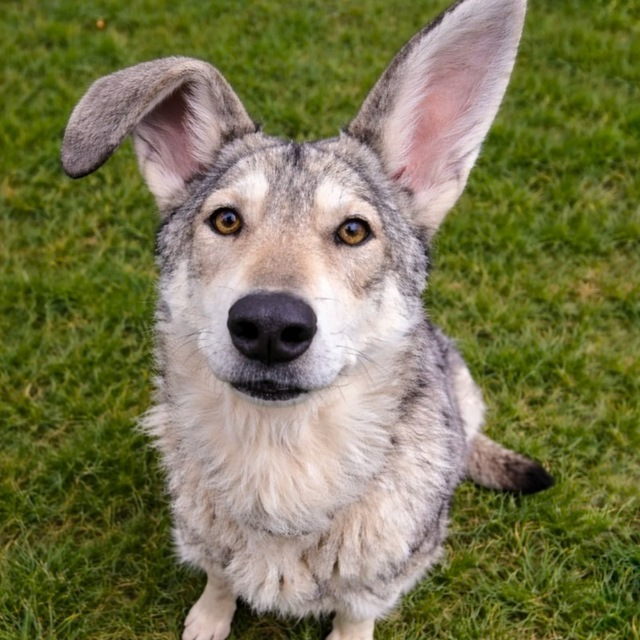
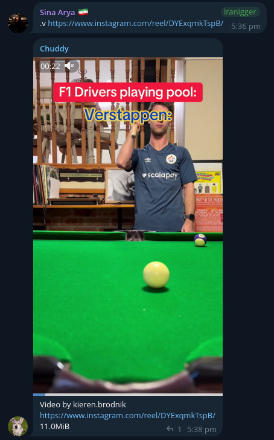
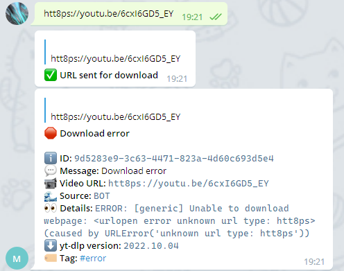

## Chuddy - Your friendly Telegram assistant 🐺🐰

Self-hosted Telegram bot for downloading audio and video from [yt-dlp](https://github.com/yt-dlp/yt-dlp)-supported sites, with OCR and translation features built in.

Built by [Riley](https://t.me/hicuckomori), Yandex Translation script by [Intruder Alert](https://t.me/weird_autumn).




## Features

* Download audio and video from 1000+ sites supported by [yt-dlp](https://github.com/yt-dlp/yt-dlp)
* Upload downloaded media directly back to Telegram
* Use in private chats or groups
* OCR + translate text from images (powered by Yandex)
* Text translation (powered by Google Translate)
* Trigger downloads via the REST API
* Track and manage download tasks via the API
* Cookie-based authentication for protected sites

## Prerequisites

* [Docker](https://docs.docker.com/get-docker/) and [Docker Compose](https://docs.docker.com/compose/install/)
* A Telegram bot token (from [@BotFather](https://t.me/BotFather))
* Telegram API credentials ([get them here](https://my.telegram.org/apps)) -- `api_id` and `api_hash`
* Your Telegram user ID ([find it here](https://stackoverflow.com/questions/32683992/find-out-my-own-user-id-for-sending-a-message-with-telegram-api))

## Quick Setup

### 1. Clone the repository

```bash
git clone https://github.com/YOUR_USERNAME/chuddy.git
cd chuddy
```

### 2. Configure environment files

The `envs/` directory contains environment files for each service. The defaults work out of the box for local development, but **you should change the database passwords** for any public-facing deployment:

```bash
# Generate a secure password
openssl rand -base64 32
```

Edit `envs/common.env` and replace the default `POSTGRES_PASSWORD` and `RABBITMQ_PASSWORD` values.

### 3. Configure the bot

```bash
cp app_bot/config-example.yml app_bot/config.yml
```

Edit `app_bot/config.yml` and fill in:

| Field | Description |
|-------|-------------|
| `api_id` | Your Telegram API ID |
| `api_hash` | Your Telegram API hash |
| `token` | Your bot token from BotFather |
| `allowed_users` -> `id` | Your Telegram user or group ID |

See `app_bot/config-example.yml` for the full list of configuration options with descriptions.

### 4. Configure storage (optional)

By default, downloaded files are saved to `./files` on the host (mapped to `/filestorage` in the container). You can change this path in `docker-compose.yml` under the `chuddy_worker` volumes:

```yaml
chuddy_worker:
  volumes:
    - "/your/custom/path:/filestorage"
```

### 5. Build and run

```bash
# Build the base image first
docker compose build base-image

# Build and start all services
docker compose up --build -d -t 0 && docker compose logs --tail 100 -f

# Stop all services
docker compose stop -t 0
```

Your bot will send a startup message once ready. Paste a video URL and Chuddy will handle the rest.

## Bot Commands

| Command | Description |
|---------|-------------|
| `.v <url>` | Download video |
| `.a <url>` | Download audio |
| `.ocr` | Reply to an image to OCR + translate text to English |
| `.tr <text>` | Translate text from any language to English |
| `.help` | Show help message |
| `/start` | Start the bot |
| `/help` | Show help |

## Configuration

### `app_bot/config.yml`

This is the main configuration file (copied from `config-example.yml`). Key sections:

**Per-user settings** (`allowed_users`):
- `download_media_type`: `VIDEO`, `AUDIO`, or `AUDIO_VIDEO`
- `save_to_storage`: Save files to disk instead of uploading to Telegram
- `upload_video_file`: Upload the downloaded file back to Telegram chat
- `upload_video_max_file_size`: Max upload size in bytes (2GB for non-premium, 4GB for premium users)
- `forward_to_group` / `forward_group_id`: Forward uploaded files to a group or channel
- `is_admin`: Admin users receive yt-dlp update notifications

**yt-dlp settings** (`ytdlp`):
- `version_check_enabled`: Check for new yt-dlp versions
- `version_check_interval`: Check interval in seconds (default 86400 = 24 hours)
- `release_channel`: `STABLE`, `NIGHTLY`, or `MASTER`

### Environment files (`envs/`)

| File | Service | Key variables |
|------|---------|---------------|
| `common.env` | All services | DB credentials, RabbitMQ, Redis, log level |
| `api.env` | API | API host, port, workers |
| `bot.env` | Bot | Application name, Telegram message size limits |
| `worker.env` | Worker | Max downloads, storage path, thumbnail settings |

### Cookies for authenticated sites

If a website requires authentication, export your cookies in Netscape format and place them in:

```
app_worker/cookies/cookies.txt
```

### Custom yt-dlp options

To customize yt-dlp download options:

1. Copy the contents of `app_worker/ytdl_opts/default.py` to `app_worker/ytdl_opts/user.py`
2. Modify as needed using [available yt-dlp options](https://github.com/yt-dlp/yt-dlp/blob/master/yt_dlp/YoutubeDL.py#L180)

## API

The REST API runs on `localhost:1984` by default. Swagger docs available at `http://127.0.0.1:1984/docs`.

| Endpoint | Method | Description |
|----------|--------|-------------|
| `/status` | `GET` | API healthcheck |
| `/v1/yt-dlp` | `GET` | Get latest and installed yt-dlp version |
| `/v1/tasks` | `POST` | Create a download task: `{"url": "<URL>"}` |
| `/v1/tasks` | `GET` | List tasks with filters: `?status=DONE&limit=10&offset=0` |
| `/v1/tasks/{id}` | `GET` | Get task by ID |
| `/v1/tasks/{id}` | `DELETE` | Delete task by ID |
| `/v1/tasks/latest` | `GET` | Get latest task |
| `/v1/tasks/stats` | `GET` | Get overall task statistics |

### API examples

Create a download task:

```bash
curl -X POST http://localhost:1984/v1/tasks \
  -H "Content-Type: application/json" \
  -d '{"url": "https://www.youtube.com/watch?v=dQw4w9WgXcQ", "download_media_type": "VIDEO", "save_to_storage": true}'
```

Get task stats:

```bash
curl http://localhost:1984/v1/tasks/stats
```

## Advanced

* **Max simultaneous downloads**: Change `MAX_SIMULTANEOUS_DOWNLOADS` in `envs/worker.env`. Default is 4. Note that the default tmpfs volume size is ~27GB in `docker-compose.yml`.
* **Thumbnail frame**: For short videos, FFmpeg generates a thumbnail at `THUMBNAIL_FRAME_SECOND` (default 10s). Adjust in `envs/worker.env`.
* **Log level**: Change `LOG_LEVEL` in `envs/common.env`. Options: `DEBUG`, `INFO`, `WARNING`, `ERROR`, `CRITICAL`.

## Service Access

| Service | Default credentials | Port |
|---------|-------------------|------|
| API | No auth | `1984` |
| RabbitMQ Management | `guest` / `guest` | `15672` |
| PostgreSQL | See `envs/common.env` | `5435` |

## Architecture

Chuddy runs as a set of Docker containers:

- **chuddy_bot** - Telegram bot interface
- **chuddy_worker** - Download processing (yt-dlp, FFmpeg)
- **chuddy_api** - REST API for programmatic access
- **chuddy_postgres** - PostgreSQL database
- **chuddy_rabbitmq** - Message queue (RabbitMQ)
- **chuddy_redis** - Cache (Redis)



## Disclaimer

This tool is intended for use only with content that you have the right to download, such as Creative Commons licensed media.

## License

BSD 3-Clause License. See [LICENSE](LICENSE) for details.
